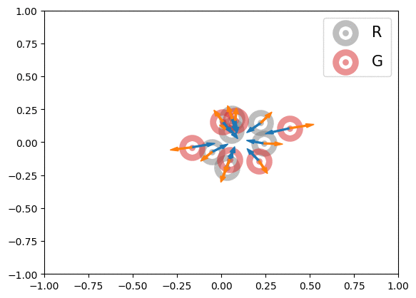
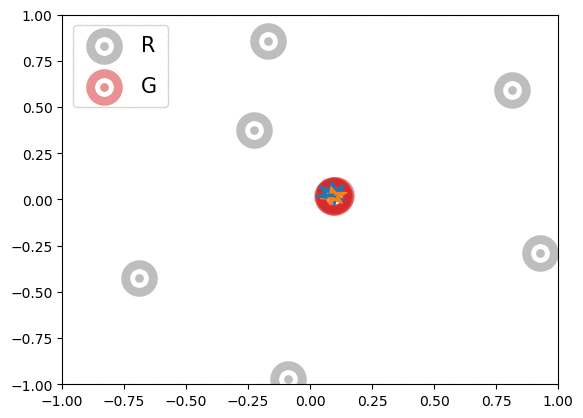

# MMD-GAN with Repulsive Loss Function
GAN: generative adversarial nets; MMD: maximum mean discrepancy; TF: TensorFlow

This repository contains codes for MMD-GAN and the repulsive loss proposed in ICLR paper [1].

## About the code
The code was written along with my learning of Python and GAN and contains many other models I have tried, so I apologize if you find it messy and confusing. The core idea is to define the neural network architecture as dictionaries to quickly test different models.

For your interest,
1. DeepLearning/my_sngan/SNGan defines how the model is trained and evaluated. 
2. GeneralTools/graph_func contains metrics for evaluating generative models (Line 1595). 
3. GeneralTools/math_func contains spectral normalization (Line 397) and a variety of loss functions for GAN (Line 2088). The repulsive loss can be found at Line 2505; the repulsive loss with bounded kernel (referred to as rmb) at Line 2530.
4. my_test_* contain the model architecture, hyperparameters, and training procedures. 

### How to use
1. Modify GeneralTools/misc_func accordingly; 
2. Read Data/ReadMe.md; download and prepare the datasets;
3. Run my_test_* with proper hyperparameters.

## About the algorithms
Here we introduce the algorithms and tricks in case you would like to implement the algorithms yourself. 

### Proposed Methods
The paper [1] proposed three methods:
1. Repulsive loss

-2\sum_{i\ne&space;j}k_D(x_i,y_j)&plus;\sum_{i\ne&space;j}k_D(y_i,y_j))

-\sum_{i\ne&space;j}k_D(y_i,y_j))

where  - real samples,  - generated samples,  - kernel formed by the discriminator  and kernel . 

The discriminator loss of previous MMD-GAN [2], or what we called attractive loss, is . Below is an illustration of the effects of MMD losses on free particles R(eal) and G(enerated) (or discriminator outputs of samples if, for illustration purpose, we allow them to move freely). These GIFs extend the Figure 1 in [1].

| | |
| :---: | :---: |
| |  |
|  |   |
|  paired with  |  paired with  |
|   |   |

In the first row, we randomly initialized the particles, and applied  or  for 600 steps. The velocity of each particle is . In the second row, we obtained the particle positions at the 450th step of the first row and applied  for another 600 steps with velocity . The blue and orange arrows stand for the gradients of attractive and repulsive components of MMD losses respectively. In summary, these GIFs indicate how MMD losses may move the free particles. Of course, the actual case of MMD-GAN is much more complex as we update the model parameters instead of output scores directly and both networks are updated at each step. 

We argue that  may cause opposite gradients from attractive and repulsive components of both  and  during training, and thus slow down the training process. Note this is different from the end-stage training when the gradients should be opposite and cancelled out to reach 0. Another way of interpretation is that, by minimizing , the discriminator maximizes the similarity between the outputs of real samples, which results in D focusing on the similarities among real images and possibly ignoring the fine details that separate them. The repulsive loss  actively learns such fine details to make real sample outputs repel each other. 

2. Bounded kernel (used only in )

&space;=\exp(-\frac{1}{2\sigma^2}\min(\left&space;\|&space;D(x_i)-D(x_j)&space;\right&space;\|^2,&space;b_u)))

&space;=\exp(-\frac{1}{2\sigma^2}\max(\left&space;\|&space;D(y_i)-D(y_j)&space;\right&space;\|^2,&space;b_l)))

The gradient of Gaussian kernel is near 0 when the input distance is too small or large. The bounded kernel avoids kernel saturation by truncating the two tails of distance distribution, an idea inspired by the hinge loss. This prevents the discriminator from becoming too confident.  

3. Power iteration for convolution (used in spectral normalization)

At last, we proposed a method to calculate the spectral norm of convolution kernel. At iteration t, for convolution kernel , do ), ), and . The spectral norm is estimated as .

### Practical Tricks and Issues
We recommend using the following tricks.
1. Spectral normalization, initially proposed in [3]. The idea is, at each layer, to use  for convolution/dense multiplication. Here we multiply the signal with a constant 1" title="C>1"/> after each spectral normalization to compensate for the decrease of signal norm at each layer. In the main text of paper [1], we used  empirically. In Appendix C.3, we tested a variety of  values.
2. Two time-scale update rule (TTUR) [4]. The idea is to use different learning rates for the generator and discriminator. 

### Final Comments
Thank you for reading!

In some cases, you may find training using the repulsive loss does not converge. Do not panic. It may be that the learning rate is not suitable. Please try other learning rate or the bounded kernel. 

Please feel free to contact me if things do not work or suddenly work, or if exploring my code ruins your day. :)

## Reference
[1] Wei Wang, Yuan Sun, Saman Halgamuge. Improving MMD-GAN Training with Repulsive Loss Function. ICLR 2019. URL: https://openreview.net/forum?id=HygjqjR9Km. \
[2] Chun-Liang Li, Wei-Cheng Chang, Yu Cheng, Yiming Yang, and Barnabas Poczos. MMD GAN: Towards deeper understanding of moment matching network. In NeurIPS, 2017.
[3] Takeru Miyato, Toshiki Kataoka, Masanori Koyama, and Yuichi Yoshida. Spectral normalization
for generative adversarial networks. In ICLR, 2018. \
[4] Martin Heusel, Hubert Ramsauer, Thomas Unterthiner, Bernhard Nessler, and Sepp Hochreiter.  GANs Trained by a Two Time-Scale Update Rule Converge to a Nash Equilibrium. In NeurIPS, 2017.
